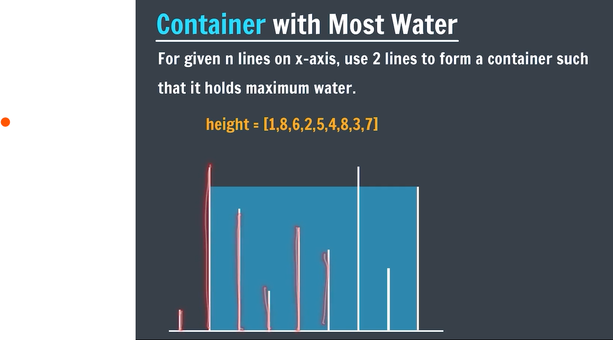

# 🧊 Container With Most Water

This project solves the classic problem **"Container With Most Water"** using a two-pointer approach to find the two lines that, together with the x-axis, form a container that holds the most water.

---

## 🖼️ Visual Explanation



---

## 📊 Input

```js
height = [1, 8, 6, 2, 5, 4, 8, 3, 7];
